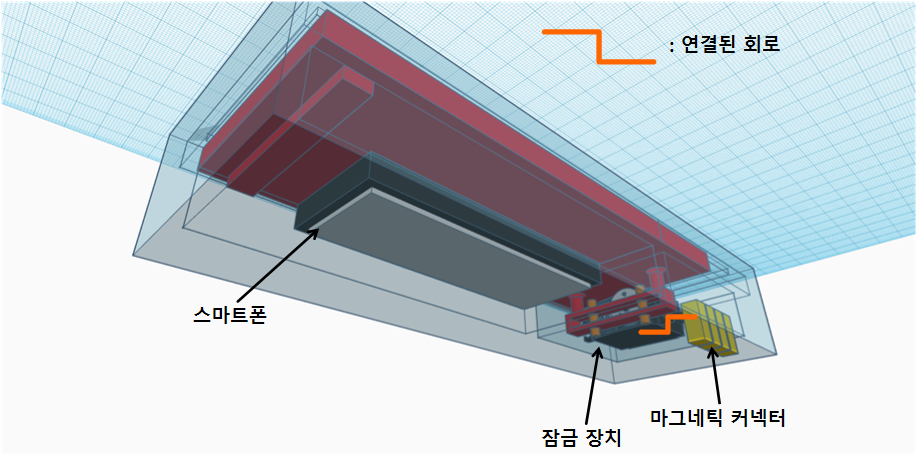
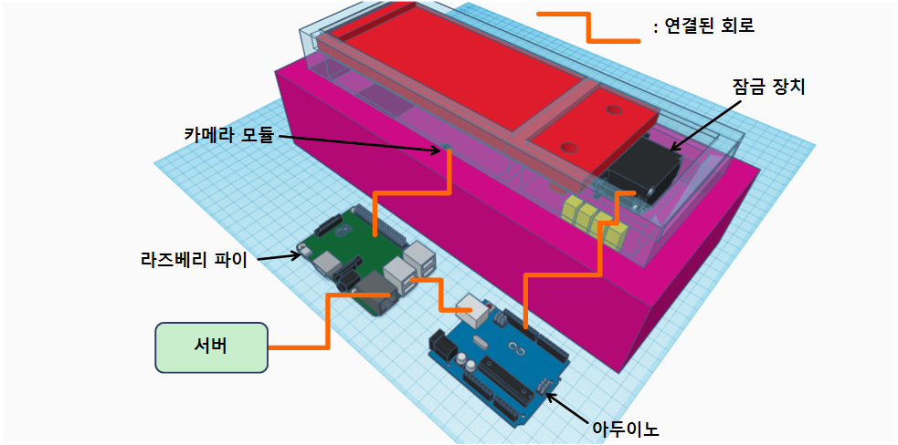
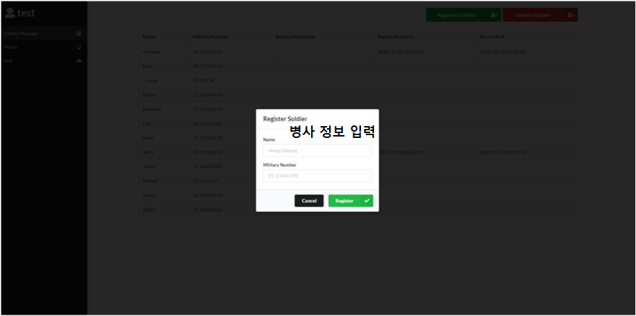
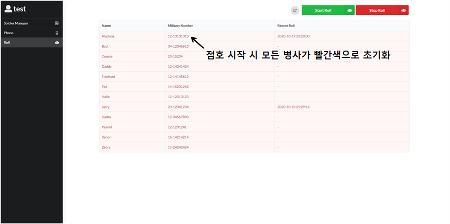
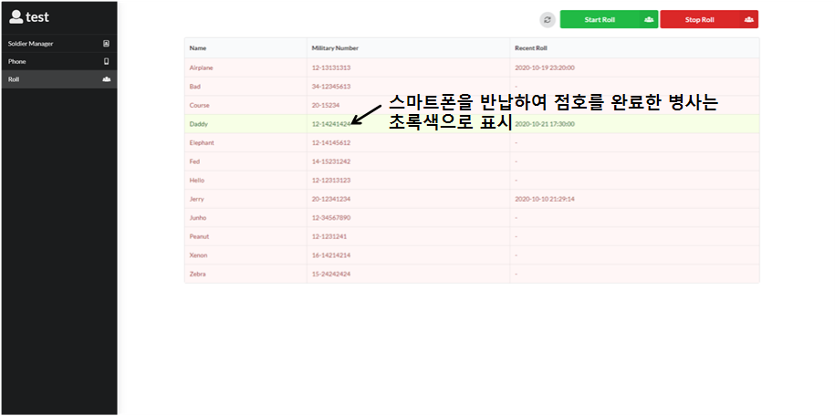

# 전달, 전달, 점호 5분전


## 프로젝트 설명 (Project Description)
**비대면 스마트폰 반납** 및 **비대면 점호**를 목표로 하는 프로젝트입니다. 스마트폰의 **생체인식 기술**과 **모바일 신분증 기술**을 활용하였습니다.

### 프로젝트 구성요소
당직사관이 직접 확인할 필요 없이, 개인적으로 생활관 복도에 나와 스마트폰을 반납하고 인원체크를 할 수 있는 시스템을 만드는 것이 목표입니다. 아이템의 구성요소는 3가지가 있습니다.

1. **스마트폰 인증 앱**. 병사는 등록된 자신의 스마트폰에 이 앱을 설치합니다. 이 앱은 병사의 인적정보와 당일 점호 정보(재실, 야간근무 등)를 포함하는 QR코드 OTP를 생성하여 화면에 띄웁니다.

2. **스마트폰 보관 상자**. 병사의 스마트폰을 보관하고, 아래의 인증기와 연동되어 잠금 및 잠금 해제되는 상자입니다. 스마트폰을 반납할 때, 병사는 QR코드 OTP를 띄운 채로 스마트폰을 상자에 넣습니다. 이 상자를 인증기에 연결시키면 QR코드를 확인한 후에 상자가 잠깁니다. 스마트폰을 꺼낼 때에는 별도의 작업 없이 인증기에 상자를 연결시키면 됩니다. 인증기가 규정에 따라 스마트폰을 꺼낼 수 있는 시간대인지 여부를 확인한 다음 상자의 잠금을 해제합니다.

3. **인증기**. 각 호실 혹은 각 층 복도에 비치 될 기기입니다. QR코드 스캐너와 상자 제어장치로 구성되어 있습니다. 병사가 스마트폰을 보관할 때에는 상자에 담겨있는 스마트폰의 QR코드를 스캔하여 상자를 잠그고, 스마트폰을 꺼낼 때에는 시간대를 확인한 후에 잠금을 해제합니다. 또한 스캔한 QR코드 정보를 통해 각 병사의 점호 정보를 갱신하고, 당직사관이나 당직병이 확인할 수 있도록 정리합니다.

### 프로젝트 의의
#### 현재 스마트폰 반납의 문제점
현재 생활관의 스마트폰 반납은 많은 문제점을 야기합니다. 일반적으로 생활관에서의 스마트폰 반납은 당직사관실에서 관리합니다. 병사들은 정해진 시간이 되면 모두 당직사관실에서 본인의 스마트폰을 찾아갑니다. 그리고 또 정해진 시간이 되면 마찬가지로 당직사관실에 스마트폰을 보관합니다. 이 때문에 당직사관실은 매일매일 정해진 시간마다 병사들로 북적입니다. 이는 매우 비효율적이며, 특히 최근같이 전염병의 위험이 큰 시기에는 매우 위험하기까지 합니다.

또한 교대 근무와 같은 어려움으로 인해 정해진 시간에 스마트폰을 찾거나 보관하기 어려운 병사들이 있습니다. 이러한 병사들은 개인적으로 당직사관실에 찾아가 당직사관의 허락을 맡고 보관함의 봉인을 풀어 스마트폰을 찾거나 보관합니다. 때문에 당직사관과 당직병은 하루에도 몇번씩 스마트폰 반납 때문에 불편함을 겪습니다.

마지막으로, 현재 스마트폰 반납은 단순히 스마트폰을 각자 배정된 서랍에 넣는 방식입니다. 그렇기에, 본인의 스마트폰은 반납하지 않고 공기계나 다른 전자기기를 대신 반납하는, 소위 '투폰' 행위를 검열하기 어렵습니다. 몇몇 부대에서는 각 스마트폰에 전화를 걸어 확인하는 방식 등을 사용하고 있지만, 매일매일 시행하지는 못합니다. 특히, 많은 병사가 있는 생활관에서 이런 확인절차는 현실적으로 어렵고 비효율적이라 이렇다 할 대처방안이 없습니다.

#### 비대면 스마트폰 반납의 필요성
이러한 문제점들을 비대면 스마트폰 반납을 통해 해결할 수 있습니다. 병사들은 각자의 호실, 또는 각 층의 복도에서 간단한 인증절차를 거쳐 본인의 스마트폰을 반납하고 보관하게 됩니다. 당직사관실은 스마트폰을 찾거나 반납하러 모이는 병사들을 관리할 필요성이 줄어들며, 병사들은 규정에 허용되는 선에서 자신에게 적합한 시간에 스마트폰을 찾고 반납할 수 있습니다. 또한 제출하는 스마트폰의 등록 정보(모델명, 시리얼 넘버 등)를 확인하기 때문에 '투폰' 과 같은 규칙 위반을 간편하면서도 정확하게 검열할 수 있습니다.

#### 아이템의 확장성
비대면 스마트폰 반납 시스템은 위의 문제점을 해결하는 것 말고도 앞으로의 확장 가능성 또한 무궁무진합니다. 하나의 활용 방안으로 점호관리 체계의 자동화를 제안하고자 합니다.

현재 점호관리 체계는 아날로그적인 방식을 유지하고 있습니다. 생활관 전체적인 인원파악은 문서를 통해 당직사관 및 당직병과 공유를 하지만, 각 호실마다의 인원파악은 같은 호실을 사용하는 병사들끼리 개인적으로 근무표를 교환하여 호실 앞에 수기로 작성합니다. 그리고 당직병은 이를 확인하기 위해 일일이 호실을 돌아보며 재확인을 합니다. 때문에 현재의 시스템은 굉장히 비효율적으로 이루어지고 있고, 생활관의 모든 병사들의 많은 노력과 소통을 통해서만 정확히 행해질 수 있습니다.

비대면 스마트폰 반납 시스템은 QR코드를 통해 스마트폰을 확인하는 과정에서 점호에 필요한 정보를 같이 받아올 수 있습니다. 각 병사가 자신의 근무표를 입력하여 스마트폰을 반납한다면, 이를 정리하여 점호관리 체계를 자동화할 수 있습니다. 병사들은 본인의 근무표만 정확하게 스마트폰에 입력하면 되고, 당직사관과 당직병은 수집된 점호 정보를 활용하기만 하면 됩니다.

## 블록 다이어그램 (Block Diagram)


## 기능 설계 (Design)
### App

- Adobe XD 사용

### IoT




- TinkerCAD 사용

### Web







## 컴퓨터 구성 / 필수 조건 안내 (Prerequisites)
### Web
- Node.js v12.16.3
- MySQL v15.1
- ECMAScript 6 지원 브라우저 사용
- 권장: Google Chrome 버전 77+

### App
- React Native v0.63.3
- Android SDK 28+ (Android 9+)

### IoT
- Arduino Uno R3

## 기술 스택 (Technique Used)
### Server(back-end)
 - [Node.js](https://nodejs.org/ko/)
 - [express](https://expressjs.com/ko/), [body-parser](https://www.npmjs.com/package/body-parser), [crypto](https://nodejs.org/api/crypto.html)
 - [MySQL](https://www.mysql.com/)
 
### Front-end
 - [React.js](https://reactjs.org/)
 - [react-redux](https://redux.js.org/basics/usage-with-react), [semantic-ui-react](https://react.semantic-ui.com/)

### App
 - [React Native](https://reactnative.dev/)
 - [react-native-paper](https://callstack.github.io/react-native-paper/), [react-native-navigation](https://reactnavigation.org/), [react-native-device-info](https://www.npmjs.com/package/react-native-device-info), [react-native-biometrics](https://www.npmjs.com/package/react-native-biometrics), [react-native-qrcode-svg](https://www.npmjs.com/package/react-native-qrcode-svg)

### IoT
 - [Arduino](https://www.arduino.cc/)
 - [Servo.h](https://www.arduino.cc/reference/en/libraries/servo/)

## 설치 안내 (Installation Process)
### App
```bash
$ git clone https://github.com/osamhack2020/App_5MinsUntilRollCall_CorrectButWhyWA.git
$ cd App_5MinsUntilRollCall_CorrectButWhyWA/
$ npm install
$ npm run-script build
```

### Web
```bash
$ git clone https://github.com/osamhack2020/Web_5MinsUntilRollCall_CorrectButWhyWA.git
$ cd Web_5MinsUntilRollCall_CorrectButWhyWA/
$ cd backend/
$ npm install
$ node app.js &
$ cd ../frontend/
$ npm install
$ npm start
```

## 프로젝트 사용법 (Getting Started)
### 시연 영상 (Preview Video)
영상 첨부 예정

### 사용 방법 (How to Use)
Blah Blah Blah
 
## 팀 정보 (Team Information)
- Young In Kim (daddy4321@naver.com), Github Id: Young-in
- Jun Ho Kim (ploffer11@naver.com), Github Id: ploffer11

## 저작권 및 사용권 정보 (Copyleft / End User License)
 * [MIT](https://github.com/osamhack2020/App_5MinsUntilRollCall_CorrectButWhyWA/blob/master/license.md)
