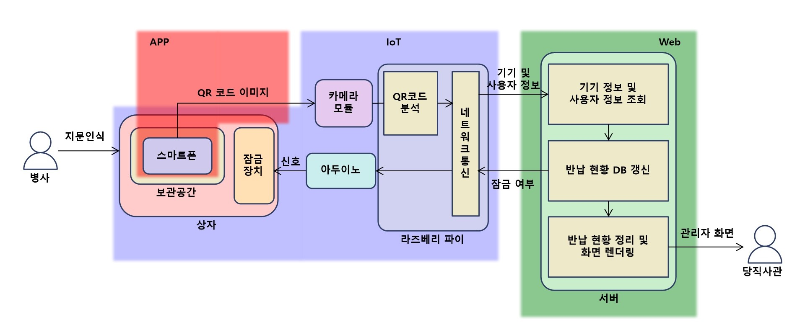
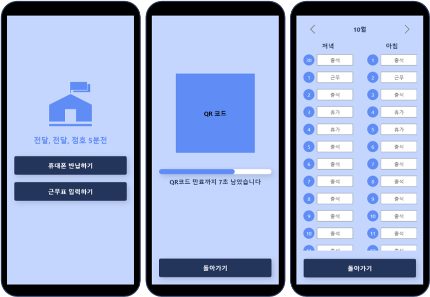
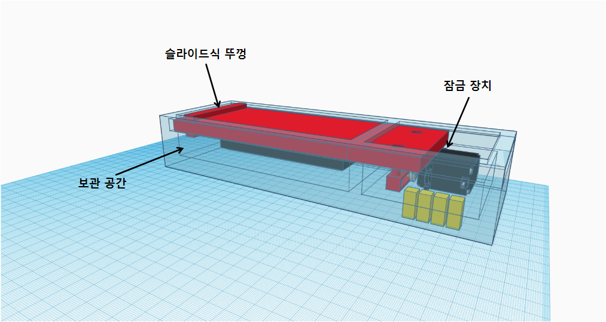
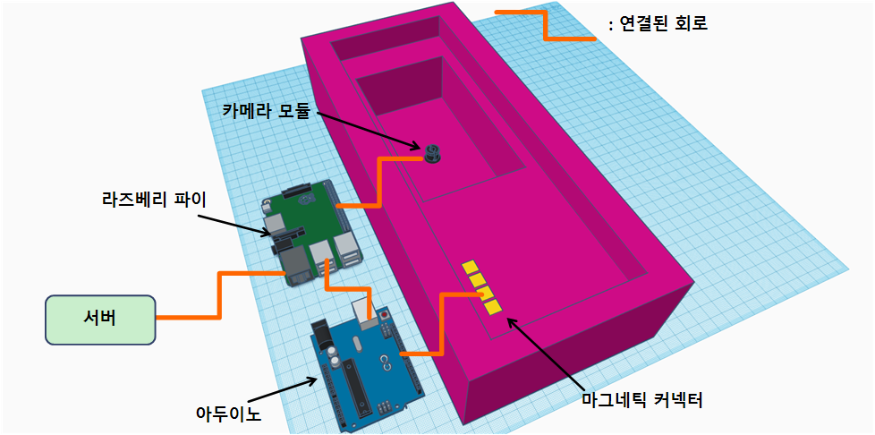
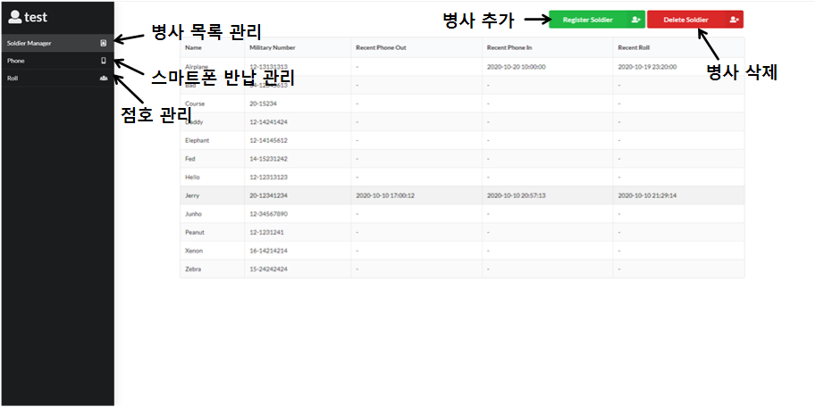
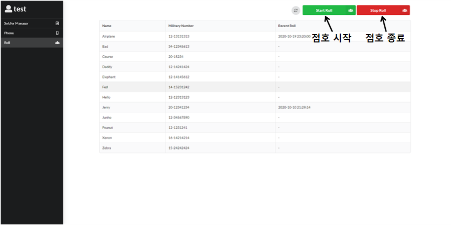

# 전달, 전달, 점호 5분전

* App 저장소: https://github.com/osamhack2020/App_5MinsUntilRollCall_CorrectButWhyWA
* IoT 저장소: https://github.com/osamhack2020/IoT_5MinsUntilRollCall_CorrectButWhyWA
* Web 저장소: https://github.com/osamhack2020/Web_5MinsUntilRollCall_CorrectButWhyWA

## 프로젝트 설명 (Project Description)
**비대면 스마트폰 반납** 및 **비대면 점호**를 목표로 하는 프로젝트입니다. 스마트폰의 **생체인식 기술**과 **모바일 신분증 기술**을 활용하였습니다.

### 프로젝트 구성요소
당직사관이 직접 확인할 필요 없이, 개인적으로 생활관 복도에 나와 스마트폰을 반납하고 인원체크를 할 수 있는 시스템을 만드는 것이 목표입니다. 아이템의 구성요소는 3가지가 있습니다.

1. **스마트폰 인증 앱**. 병사는 등록된 자신의 스마트폰에 이 앱을 설치합니다. 이 앱은 병사의 인적정보와 당일 점호 정보(재실, 야간근무 등)를 포함하는 QR코드 OTP를 생성하여 화면에 띄웁니다.

2. **스마트폰 보관 상자**. 병사의 스마트폰을 보관하고, 아래의 인증기와 연동되어 잠금 및 잠금 해제되는 상자입니다. 스마트폰을 반납할 때, 병사는 QR코드 OTP를 띄운 채로 스마트폰을 상자에 넣습니다. 이 상자를 인증기에 연결시키면 QR코드를 확인한 후에 상자가 잠깁니다. 스마트폰을 꺼낼 때에는 별도의 작업 없이 인증기에 상자를 연결시키면 됩니다. 인증기가 규정에 따라 스마트폰을 꺼낼 수 있는 시간대인지 여부를 확인한 다음 상자의 잠금을 해제합니다.

3. **인증기**. 각 호실 혹은 각 층 복도에 비치 될 기기입니다. QR코드 스캐너와 상자 제어장치로 구성되어 있습니다. 병사가 스마트폰을 보관할 때에는 상자에 담겨있는 스마트폰의 QR코드를 스캔하여 상자를 잠그고, 스마트폰을 꺼낼 때에는 시간대를 확인한 후에 잠금을 해제합니다. 또한 스캔한 QR코드 정보를 통해 각 병사의 점호 정보를 갱신하고, 당직사관이나 당직병이 확인할 수 있도록 정리합니다.

## 블록 다이어그램 (Block Diagram)

## 기능 설계 (Design)
### App

- Adobe XD 사용

### IoT

- TinkerCAD 사용

### Web

## 자세한 문서 (Document for More Information)
https://daddy321.gitbook.io/5minsuntilrollcall/

## 컴퓨터 구성 / 필수 조건 안내 (Prerequisites)
### Web
- Node.js v12.16.3
- MySQL v15.1
- ECMAScript 6 지원 브라우저 사용
- 권장: Google Chrome 버전 77+

### App
- React Native v0.63.3
- Android SDK 28+ (Android 9+)

### IoT
- Arduino Uno R3
 
## 팀 정보 (Team Information)
- Young In Kim (daddy4321@naver.com), Github Id: Young-in
- Jun Ho Kim (ploffer11@naver.com), Github Id: ploffer11

## 저작권 및 사용권 정보 (Copyleft / End User License)
 * [MIT](https://github.com/osamhack2020/App_5MinsUntilRollCall_CorrectButWhyWA/blob/master/license.md)
